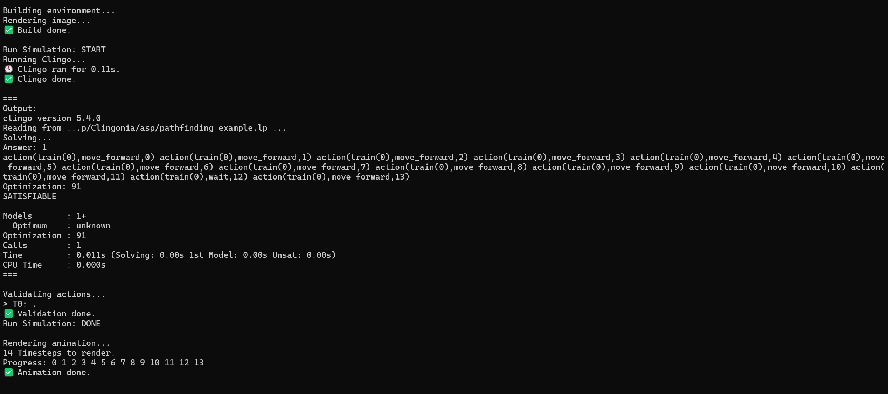

# Clingonia by MadMotion


## 🌹 Introduction
Experience next-generation Flatland environment management with our cutting-edge software "Clingonia".

Effortlessly generate, build, modify, save, and solve environments using Clingo powered by the Answer Set Programming Language.

Additionally, visualize your solutions as a numbered path, detailed timetable, or animated GIF for clear, actionable insights.

<br>

## 🏡 Repository structure

- 📁 `asp` is where YOU can put your `lp` files (working `lp` files included).
- 📁 `code` contains Python source codes.
- 📁 `data` contains images, saved parameters, helper texts, and runtime information.
- 📁 `env` contains environment `lp` encodings.
- 📝 `main.py` is the primary file for launching the program.
- 📝 `README.md` is what you are reading right now.

<br>

## ⚙️ Please note:

✅ This software is optimized for Windows and macOS.

ℹ️ Based on user reports, it also runs on Linux, though minor limitations may occur.

<br>

## 🌱 Getting started: Flatland and Clingo

### 🚆 Flatland
Flatland is a [railway scheduling challenge](https://flatland.aicrowd.com/intro.html) hosted by AICrowd to address the problem of multi-agent pathfinding for trains in large railway networks.

<br>

### 📜 Prerequisites

It is recommended to install [Anaconda](https://www.anaconda.com/distribution/) and create a new conda environment:
```
conda create python=3.11 --name flatland
conda activate flatland
```

📦 Install Flatland (Version 4.2.2 or newer):
```
pip install flatland-rl==4.2.2
```

📦 (Optional) Install the clingo CLI:
```
conda install -c potassco clingo
```

📦 Install required Python packages:

`clingo`, `imageio`, `pillow`, `numpy`, `pandas`, `matplotlib`.
```
pip install <package>
```

<br>

### 🖥️ Installation

Clone this repository to use it locally:
```
git clone https://github.com/M4X-VOGEL/Clingonia.git
```

<br>

# 🏛️ Using Clingonia

### 🐣 Initial development

Clingonia provides ASP encodings to support all core features.

If you want to use your own ASP encodings, make sure that they are capable of solving Flatland problems.  During the development phase, the `lp` representation of the environment may be beneficial for initial testing and debugging of the encoding or encodings.  Keep in mind that several encodings can be called simultaneously by clingo, for example:
```
clingo env.lp example1.lp example2.lp
```

The order does not matter.  What will ultimately be necessary is that your output must contain actions in this format:
`action(train(ID), Action, Timestep).` 

Valid `Action` values are:
- `move_forward`
- `move_left`
- `move_right`
- `wait`

Once your encodings produce valid paths in the required `action(...)` format, they are compatible with Clingonia. If Clingonia does not offer a particular feature, it must be integrated into your problem-solving LP files.

<br>

### 🗺️ Custom environment encodings

Valid predicates are:
- `global(MaxTime).`
- `train(ID).`
- `start(ID,(X,Y),Earliest_Dep,Dir).`
- `end(ID,(X,Y),Latest_Arr).`
- `cell((X,Y),Track).`

Keep in mind:
- `row=X`
- `col=Y`
- Earliest_Dep is the earliest timestep a train moves away from its starting position, with the train always spawning one timestep prior.


<br>

## 🚀 Program initialization

1. (Optional) Put your problem-solving `lp` files into 📁 `asp` (they may also be located elsewhere).
2. Make sure you are in the directory of your cloned repository with 📝 `main.py` and run the following:
```
python main.py
```
This will launch the program.

<br>

### 🛠️ Troubleshooting

If you encounter unexpected issues, please report them right away. Your input is extremely helpful to us.

<br>

### ⚠️ Known issues

- Our example `ASP` code for solving environments is provided for reference and simple environments. It is not flawless. We recommend using your own implementation for optimal results.
- Flatland sometimes generates environments larger than requested. Clingonia trims them to match the request, which may cut off part of the railway system. Fortunately, this can be quickly resolved by the user in the Modify Environment mode.

<br>

# 👁️ Insights

### Build New Environment


### Main Menu


### Run Simulations


### Review Solutions


### Transparency

