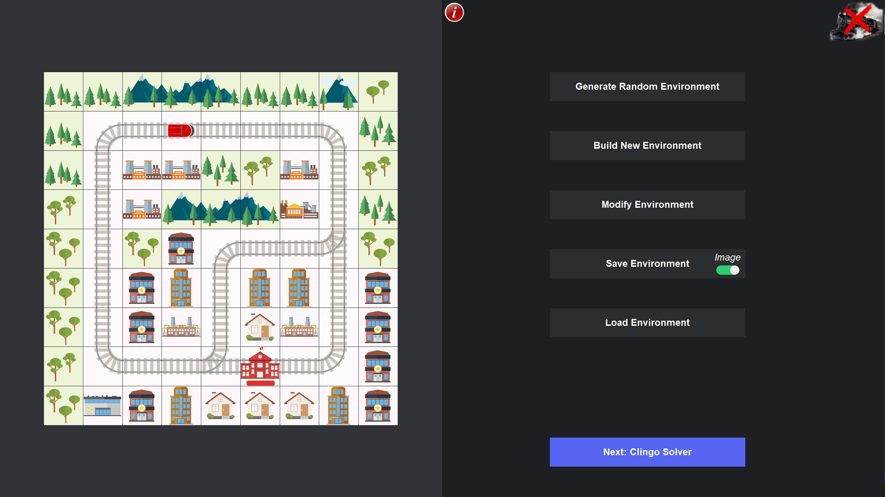
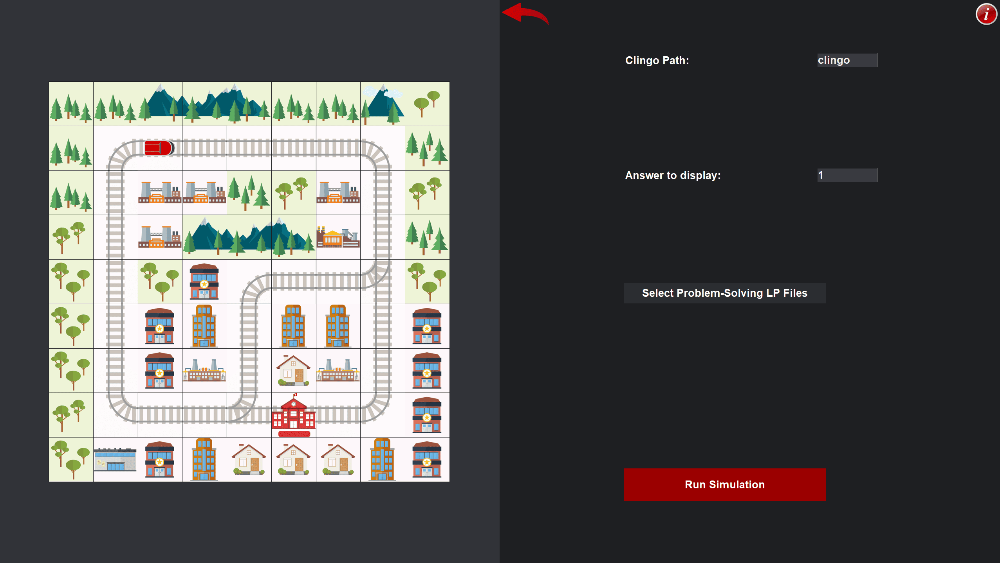

# Clingonia by MadMotion


## 🌹 Introduction
Experience next-generation Flatland environment management with our cutting-edge software "Clingonia".

Effortlessly generate, build, modify, save, and solve environments using Clingo powered by the Answer Set Programming Language.

Additionally, visualize your solutions as a numbered path, detailed timetable, or animated GIF for clear, actionable insights.

<br>

## 🏡 Repository structure

- 📁 `asp` is where YOU can put your `lp` files (working `lp` files included).
- 📁 `code` contains Python source codes.
- 📁 `data` contains images, saved parameters, helper texts, and runtime information.
- 📁 `env` contains environment `lp` encodings.
- 📝 `main.py` is the primary file for launching the program.
- 📝 `README.md` is what you are reading right now.

<br>

## ⚙️ Please note:

⚠️ This software is optimized for Windows and macOS.

<br>

## 🌱 Getting started: Flatland and Clingo

### 🚆 Flatland
Flatland is a [railway scheduling challenge](https://flatland.aicrowd.com/intro.html) hosted by AICrowd to address the problem of multi-agent pathfinding for trains in large railway networks.

<br>

### 📜 Prerequisites

It is recommended to install [Anaconda](https://www.anaconda.com/distribution/) and create a new conda environment:
```
conda create python=3.11 --name flatland
conda activate flatland
```

📦 Then, install the stable release of Flatland (Version 4.2.2 or newer):
```
pip install flatland-rl==4.2.2
```

📦 To use the clingo CLI (optional), install the required clingo package:
```
conda install -c potassco clingo
```

📦 Additionally, ensure that the following required packages are installed:

`clingo`, `imageio`, `pillow`, `numpy`, `pandas`, `matplotlib`.
```
pip install [package]
```

<br>

### 🖥️ Installation

To use this repository locally, clone it:
```
git clone https://github.com/M4X-VOGEL/Clingonia.git
```

<br>

# 🏛️ Using Clingonia

### 🐣 Initial development

We will provide all necessary resources to be able to use all features of Clingonia.

If you want to use your own ASP encodings, make sure that they are capable of solving Flatland problems.  During the development phase, the `lp` representation of the environment may be beneficial for initial testing and debugging of the encoding or encodings.  Keep in mind that several encodings can be called simultaneously by clingo, for example:
```
clingo env.lp example1.lp example2.lp
```

The order is not important.  What will ultimately be necessary is that the output be appropriately formatted in the following manner:
`action(train(ID), Action, Timestep).` 

The `Action` variable must be one of the following:
- `move_forward`
- `move_left`
- `move_right`
- `wait`

Once an encoding or set of encodings has been developed that produces valid paths in the form of the appropriate `action(...)` output, developers can initialize the program. If Clingonia does not offer a particular feature, it must be integrated into your problem-solving LP files.

<br>

### 🗺️ Custom environment encodings

Valid predicates are:
- `global(MaxTime).`
- `train(ID).`
- `start(ID,(X,Y),Earliest_Dep,Dir).`
- `end(ID,(X,Y),Latest_Arr).`
- `cell((X,Y),Track).`

Keep in mind:
- `row=X`
- `col=Y`
- Earliest_Dep is the earliest timestep a train moves away from its starting position, with the train always spawning one timestep prior.


<br>

## 🚀 Program initialization

1. It is optional to put your `lp` files into the 📁 `asp` folder. They can be in any directory.
2. Ensure that you are in the directory of your cloned repository with 📝 `main.py` and type the following:
```
python main.py
```
This will launch the program.

<br>

### 🛠️ Troubleshooting

If you encounter unexpected issues, please report them right away. Your input is extremely helpful to us.

<br>

### ⚠️ Known issues

- Panning is currently not supported for touchpads. To zoom, place the cursor and swipe up or down with two fingers.
- Users may experience decreased responsiveness when zooming in closely on environments.
- Our example `ASP` code for solving environments is provided for reference and simple environments. It is not flawless. We recommend using your own implementation for optimal results.

- (!) The following parameters currently have **no impact on Clingo** and may be enhanced in the future by upcoming students:
- `Speed ratio map`
- `Malfunction rate`
- `Min./Max. duration for malfunctions`.

<br>

# 👁️ Insights

### Build New Environment


### Main Menu


### Run Simulations


### Review Solutions

